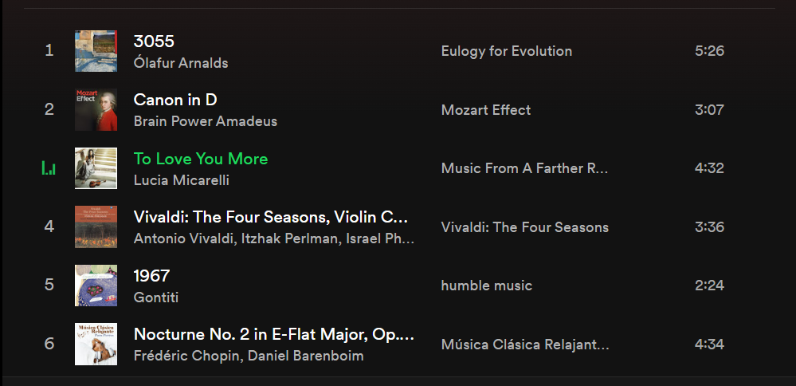

## 欢迎
你好呀！欢迎来到我的博客！

目前我还是一名博客的初学者，很多东西还正在学习，以后会把我的博客弄的更好看的！^o^

这里主要是我用于分享的地方，每天学习一点点相信我的博客一定会非常棒的！

继续努力，加油加油哈哈哈！目标是成为最自由的工程师👩‍💻！！！！

## 自我介绍
👻我是Hau，也可以叫我小波，目前在广东读书，电子科学与技术大三学生

## 兴趣爱好
* 喜欢一个人旅游，citywalk，去过好多座城市，最喜欢上海和澳门  
*下图制作源自微信小程序“极简足迹”*

* 11年动漫爱好者，老二次元了，各种类型的番都有看，这几年看的比较少了。最爱《EVA》，没有特别喜欢的动漫角色，因为我全部都要！
  
* 海边爱好者，极度喜欢海天一色的美景，若是闲下来定会去海边坐着，什么都不做，也能感受到灵魂的洗涤。
  
* 喜欢折腾破手机，目前手持Redmi K40 6+128G，我自己改成了MIUI Global，相机也改了谷歌相机。香是真的香，水土不服的时候也挺难受的，消息推送不及时、部分app存在版本不同无法正常使用等。如果可以我希望以后能买个pixel玩，我玩pixel是因为我喜欢谷歌吗？不，是因为我贱(bushi)。
  
* 摄影爱好者，非专业，就是喜欢到处拍拍拍，我觉得好看就行了。设备是Redmi K40的谷歌相机，外加一个64倍手机外置长焦镜头，还不错吧。
  
* 纯音乐爱好者，五音不全，乐器不认识，曲名记不住，但是耳朵很有耳力，总能与曲子共鸣，享受精神乐趣。下面是我在spotify创建的歌单的部分歌曲，Instrumental真的超赞的。
  
  
## 联系方式
下面是我的一些联系方式：

这是我的Github: [Aurora7july](https://github.com/Aurora7july)

这是我的知乎: [杭雨雾里沙](https://www.zhihu.com/people/Aurora7july)

这是我的邮箱:yep6344@gmail.com

这是我的QQ：3203488420

欢迎留言！